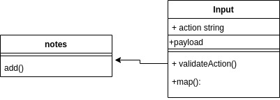

# notes

## class 1

- Repository Name: `notes`
- Branch Name: `class-1-notes`

added startup code and create input and index modules and their implementation
it took 4 hours

## class 2

- Repository Name: `notes`
- Branch Name: `class-2`

used classes instead of function constructors and add test using jest

it took 4 hours

### How to Use:

```
node nodes.js --add "This is a really cool thing that I wanted to remember for later"
```

### How to test:

```
Unit Tests: npm run test

Lint Tests: npm run lint
```

## How do I install the app or library?

```
 git clone https://github.com/Mohammad-Eshtaiwi/notes
```


